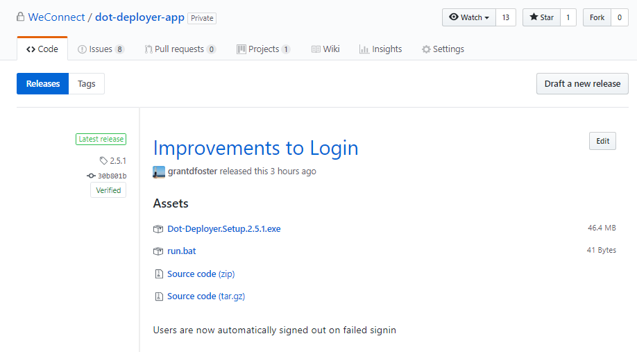

# Dot Deployer


# A Desktop Application for Deploying Tools
*Dot Deployer uses the GitHub API to make tool deployment easy and painless*

[](https://circleci.com/gh/WeConnect/dot-deployer-client)

# 2.6.0 Release Notes
### Improvements to App Man Uninstall
*Deployer will uninstall App Man even if it is currently running...*


### Available Updates Visible in UI
*Install button will highlight orange when updates are available*


*Updates are normally **automatically installed**, unless:*
1. The update is a prerelease
2. A program was running when the update attempted to install
3. The tool is set to not autoupdate

### Improved Developer Panel
*Developers can search users and browse installs*


# User Documentation

## 1. Install the Application
*the install link is above!*

## 2. Log In
*please login with your WeWork Google account*


## 3. Install a Tool


## 4. Uninstall a Tool


## 5. Find Documentation and Support


# Developers
*developers should be **added as an administrator** to easily test tools before releasing to users*

# Setting up a Repository
*in five easy steps*

## 1. Install GitHub Application
*first, you must add the GitHub Application to your repository.  Visit the link below to do so -- you must be an admin on your GitHub team to access!*

https://github.com/organizations/WeConnect/settings/installations/172208


## 2. Add .deployer File
*add a .deployer file in your master branch with metadata to tell the desktop client how to install your tool.  Please see below for more information on available schemas!*


## 3. Create Releases
*Dot Deployer will see the releases in your repository and use their metadata to generate available downloads*



## 4. Test Installing & Uninstalling
*admins on the desktop client will see repositories that the GitHub Application is installed on, whether or not they have been released to users.  Tools available for release are marked with a **yellow rocket***


## 5. Release to Users
*release a tool to users by clicking the yellow rocket next to it, or, unrelease a tool by clicking the red trashcan*


## .deployer File Schemas
***Version 3.0.0** of the .deployer Schema is documented below.  The **version** tag in your .deployer file tells Dot Deployer which schema you are using.  All assets are downloaded into the TEMP folder and then processed based on the configuration of the .deployer file*
```json
[{
  "version": "3.0.0",
  "schema": {
    "type": "object",
    "properties": {
      "version": {
        "type": "string",
        "required": true
      },
      "autoupdate": {
        "type": "boolean",
        "required": false
      },
      "processes": {
        "type": "array",
        "required": false,
        "items": {
          "type": "object",
          "properties": {
            "name": {
              "type": "string",
              "required": true
            }
          },
          "additionalProperties": false
        }
      },
      "urls": {
        "type": "object",
        "required": false,
        "properties": {
          "documentation": {
            "type": "string",
            "required": false
          },
          "support": {
            "type": "string",
            "required": false
          },
          "feedback": {
            "type": "string",
            "required": false
          }
        },
        "additionalProperties": false
      },
      "install": {
        "type": "array",
        "required": true,
        "items": {
          "type": "object",
          "required": true,
          "properties": {
            "action": {
              "type": "string",
              "required": true,
              "enum": ["run", "copy"]
            },
            "destination": {
              "type": "string",
              "required": false
            },
            "source": {
              "required": true,
              "type": "string"
            }
          },
          "additionalProperties": false
        }
      },
      "uninstall": {
        "type": "array",
        "required": true,
        "items": {
          "type": "object",
          "required": true,
          "properties": {
            "action": {
              "type": "string",
              "required": true,
              "enum": ["run", "delete"]
            },
            "source": {
              "required": true,
              "type": "string"
            }
          },
          "additionalProperties": false
        }
      },
      "dependson": {
        "type": "array",
        "required": false,
        "items": {
          "type": "object",
          "properties": {
            "name": {
              "type": "string"
            }
          }
        }
      }
    },
    "additionalProperties": false
  }
}]
```
## Examples
***Note:** the desktop client will **validate your .deployer file** when you attempt to **install** or **uninstall** the tool, and will **identify any errors** as necessary*

### Example 1: Dot Deployer
*this .deployer file will:*
1. run a file named **run.bat** after all assets in the release are downloaded (assets=true)

***Note:** this is the .deployer file the deployer application uses to install itself.  In this case, there are two assets in the release: a **run.bat** file and an **installer.exe**.  There is a quick script in the .bat file to launch the installer: **START %TEMP%\installer.exe**.*
```json
{
	"version": "2.0.0",
	"autoupdate": true,
  "assets": true,
	"install": [
		{
			"action": "run",
			"source": "run.bat"
		}
	]
}
```

# Developer Documentation

1. Install Packages

```shell
yarn install
```

2. Add .env File in Root Directory
*contact Grant Foster for environment variables for Development!*
*production variables are handled in the CircleCI build*

3. Run Application Locally

```shell
yarn electron:serve
```

4. Build Application Locally

```shell
yarn electron:build
```
