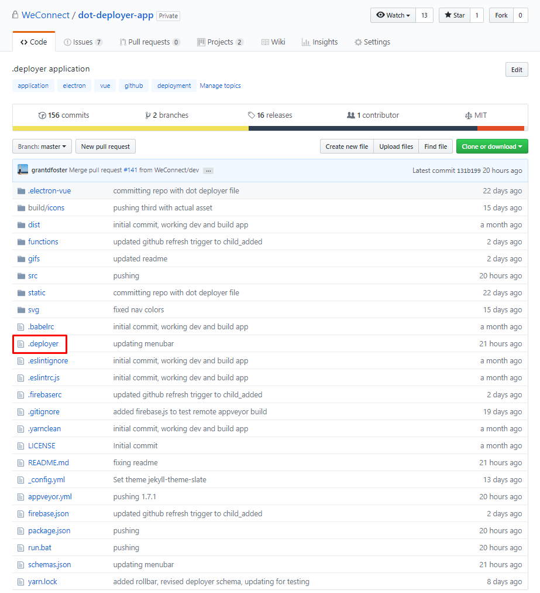
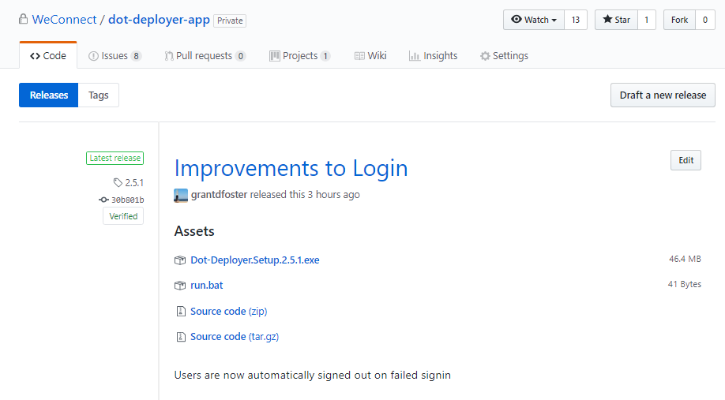
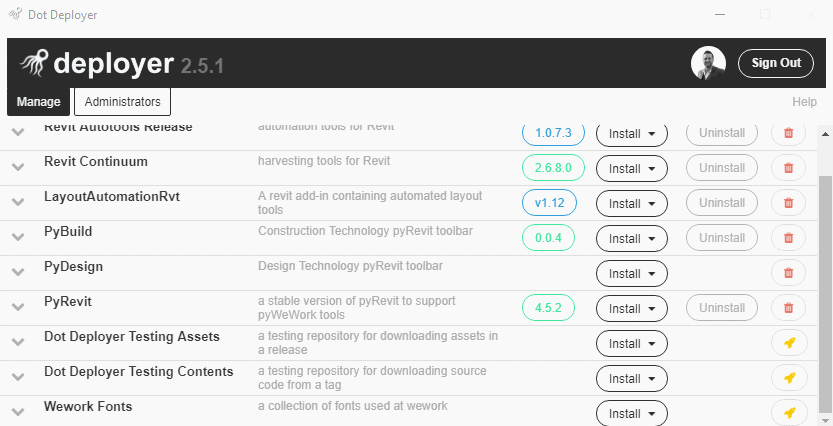

# Developer Documentation
*a few words about setting up your tool to be added to DotDeployer*

**#1** - Add Your Repository to Your Team's GitHub Application

- *navigate to https://github.com/organizations/[TEAM-NAME]/settings/installations/[INSTALLATION-ID] to add your repository to your team's GitHub Application*

- *for example, WeWork's url is: https://github.com/organizations/WeConnect/settings/installations/543395*

**#2** - Add A .deployer File To Your Repository

- *a .deployer file is a JSON configuration file that tells DotDeployer how to install your repository*
- *see [here](../schemas/README.md) for available schemas.  the latest is currently 3.0.0*

## 3. Create Releases
*Dot Deployer will see the releases in your repository and use their metadata to generate available downloads*

## 4. Test Installing & Uninstalling
*admins on the desktop client will see repositories that the GitHub Application is installed on, whether or not they have been released to users.  Tools available for release are marked with a **yellow rocket***

## 5. Release to Users
*release a tool to users by clicking the yellow rocket next to it, or, unrelease a tool by clicking the red trashcan*

